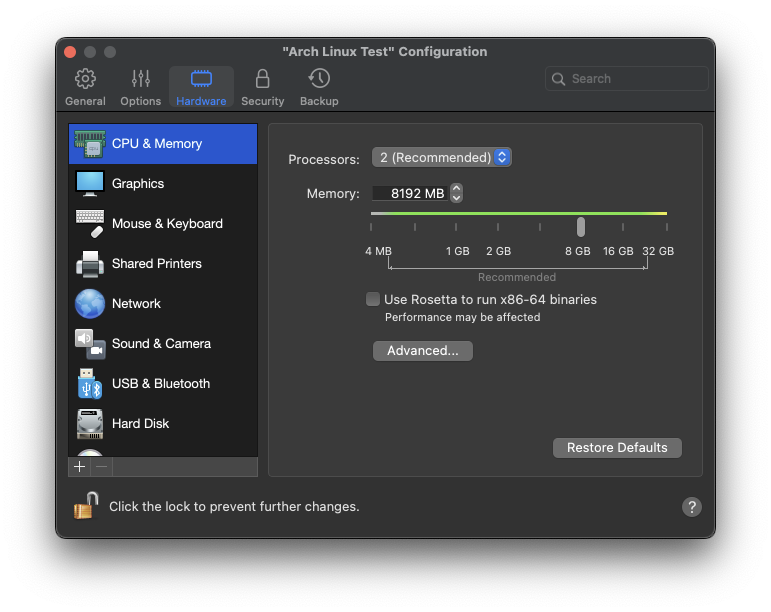
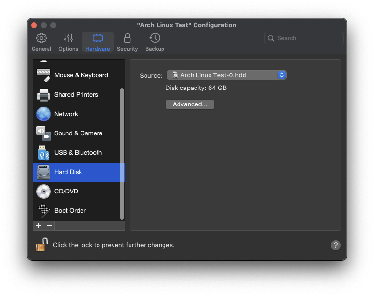

## Can Arch Linux run on MacBook Pro with Parallels?

Yes! I use an Arch Linux ARM VM on my MacBook Pro almost every day. It works quite well.

However, there's a lot of misinformation out there about installing and running Arch Linux on Apple Silicon. At the time of this post, the Arch Linux wiki currently directs users to this article by Parallels to install Arch Linux on Apple Silicon. However, the Parallel instructions are old and do not work.

To be fair, the Arch Wiki does provide a download for a pre-installed VM that is ready to go. However, it's set up with very low storage options (partitioning) and was basically useless for a daily driver for my needs.

I will attempt to keep this post recent.

## Where can I download Arch Linux ARM?

### archboot.com

The best place to download Arch Linux ARM for use with Parallels VM is [archboot.com](https://archboot.com). Download the standard ISO image - at the time of this writing, there is also a "local" (offline) installer, but it doesn't actually work for me. It gets stuck creating a container and never finishes.

### A Note on setup scripts (Do not use them)

Once you download the archboot ISO and boot off it, it will automatically start up with a CLI "GUI" installer helper program. *Do not use this* to install Arch. It is broken. Instead, you should follow the [Installation Guide](https://wiki.archlinux.org/title/Installation_guide) on the Arch Wiki.

You *can* let the GUI set up networking to easily get connected to the internet.

Don't worry, I'll post screenshots of every single step I did to make this work.

## Installation

Alright, let's get started!

### Create and configure new Parallels VM







### Boot live ISO


### Configure language, network, package mirror



**Warning:** Do not continue to use the Archboot Basic Setup! If you try to use it to partition disks and install Arch Linux ARM, it will fail and your VM will be in a broken state.

Instead, we're going to exit the Archboot Basic Setup and proceed to (mostly) follow the directions from the official [Arch Linux Installation Guide](https://wiki.archlinux.org/title/Installation_guide).


### Exit launcher (do not install Arch Linux ARM using Archboot helper script)


### Partition the disks

To partition the disks, I prefer using `cfdisk`.



**Note:** Normally on bare metal I would create a separate partition for `/` and `/home`. For VMs, I typically share a partition for `/` and `/home`. You are free to add as many partitions as you'd like. This is one big reason why I recommend not using the pre-built VM linked to from the Arch Wiki. I'm glad it exists, and you might be fine with it, but I like to have the freedom to set the partition sizes to my needs.



### Format the disks

#### EFI partition

```shell
mkfs.fat -F 32 /dev/sda2
```

#### Swap space

```shell
mkswap /dev/sda3
```

#### Root and home partitions

```shell
mkfs.ext4 /dev/sda4
```

### Mount partitions

Mount the root volume to `/mnt`.

```shell
mount /dev/sda4 /mnt
```


**Note:** Recall that earlier I mentioned I'm sharing the same partition for `/` and `/home`. If you had a separate partition for `/home` you would want to mount that as well. You would do so with:

```shell
mount --mkdir /dev/sdaX /mnt/home
```



Mount the EFI partition to `/mnt/boot`

```shell
mount --mkdir /dev/sda2 /mnt/boot
```

Activate the swap partition

```shell
swapon /dev/sda3
```

If all went well, you can check that everything is properly mounted with `lsblk`:

<!--  -->

```
[root@archboot /]# lsblk
NAME   MAJ:MIN RM   SIZE RO TYPE MOUNTPOINTS
sda      8:0    0   128G  0 disk 
├─sda1   8:1    0     2M  0 part 
├─sda2   8:2    0   512M  0 part /mnt/boot
├─sda3   8:3    0     8G  0 part [SWAP]
└─sda4   8:4    0 119.5G  0 part /mnt
```

### Disable package signing


**Warning:** We're almost ready to load the minimum Arch Linux packages. This is done with `pacstrap`. Both Arch Linux `x86_64` and Arch Linux `aarch64` (ARM) use package signing. While Arch Linux `x86_64` package signing works (and you should use it), I could not get package signing to work in a Parallels VM with `aarch64` (ARM). So we're going to disable it for now.


To disable package signing, edit the file `/etc/pacman.conf` and comment out the line with `SigLevel = Required DatabaseOptional` (comment so you can easily reenable it later) and add a new line with `SigLevel = Never`:


### Installing essential packages

`pacstrap` is the tool used to install the packages you want for your new setup.

```shell
pacstrap /mnt base base-devel dhcpcd vim terminus-font
```


**Warning:** For Archboot ARM, do not install the `linux` package via `pacstrap` as the Arch Wiki Installation Guide shows. You may get an error if you do. We'll install it after we run `pacstrap`.


Here we're installing package to our mounted root partition `/mnt`. We're installing `base`, `base-devel`, `dhcpcd`, `vim` and `terminus-font`. `terminus-font` is needed because it doesn't get auto-installed correctly via Arch Linux ARM's `base` package, and will cause errors when the linux image is being generated. `dhcpcd` will allow us later to connect to the network with DHCP.

This will take some time to install, depending on your internet connection. Once complete, we can move on to the next step, where we're configure the system.

### Configure the installation

Generate `/etc/fstab`

```shell
genfstab -U /mnt >> /mnt/etc/fstab
```

Change root into the new system. This will "enter" us into the newly installed environment:

```shell
arch-chroot /mnt
```

Set the time zone

```shell
ln -sf /usr/share/zoneinfo/Region/City /etc/localtime
```

Replace `Region` and `City` with your own. For example, my closest timezone region and city are `America/Detroit`.

Run `hwclock` to generate `/etc/adjtime`:

```shell
hwclock --systohc
```

Configure localization settings:

1. Edit `/etc/locale.gen` and uncomment your locales. Mine is `en_US.UTF-8`.
1. Save and close the file.
1. Run `locale-gen`.

Create `/etc/locale.conf` and set the LANG variable to the value you uncommented in `/etc/locale.gen`:

```shell
LANG=en_US.UTF-8
```

Finally, set your hostname in `/etc/hostname`.

### Disable package signing on the installed OS

Earlier I mentioned when running `pacstrap` not to install the `linux` package, as it will break. We're going to install it soon, but first we need to disable package signing for the installed OS.

I also mentioned earlier that package signing is broken in the current release of Archboot ARM, and we had already disabled it for the live ISO. But after `arch-chroot` we have to disable it again for the installed (not the live ISO) system.

To disable package signing, we do the same thing as before. Edit the file `/etc/pacman.conf` and comment out the line with `SigLevel = Required DatabaseOptional` (comment so you can easily reenable it later) and add a new line with `SigLevel = Never`:


### Install the Linux kernel

We're finally ready to install the Linux kernel:

```shell
pacman -S linux
```


**Note:** You may see warnings while the `linux` package is installing. You can ignore these. As long as you don't see errors, you should be OK.

Also, if you aren't sure whether the `linux` package completed successfully, or if you had already installed the `linux` package earlier via `pacstrap` and it errored out, you can always re-run the initramfs generation with `mkinitcpio -P`.


### Set the root password

```
passwd
```

### Boot loader (Grub)

I prefer Grub as I'm familiar with it, it's super popular, easy to set up, and I know it works with Parallels VMs on ARM, so that's what I'll show here.

That being said, you can try to use whatever boot loader you want. See the Arch Linux Wiki info on [boot loaders](https://wiki.archlinux.org/title/Boot_loader).

Install `grub` and `efibootmgr`:

```shell
pacman -S grub efibootmgr
```

Install the bootloader with grub:

```shell
grub-install --target=arm64-efi --efi-directory=/boot --bootloader-id=GRUB
```

The grub bootloader will use the file `/boot/grub/grub.cfg` to boot the OS each time the VM starts. To generate `grub.cfg`, run:

```shell
grub-mkconfig -o /boot/grub/grub.cfg
```

If successful, you should see output similar to this:

```
Generating grub configuration file ...
Found linux image: /boot/Image
Warning: os-prober will not be executed to detect other bootable partitions.
Systems on them will not be added to the GRUB boot configuration.
Check GRUB_DISABLE_OS_PROBER documentation entry.
Adding boot menu entry for UEFI Firmware Settings ...
done
```

### Reboot

Your system is now installed! Exit the `arch-chroot` environment with `exit` command or `Ctrl + D`. Then you can simply type `reboot` and the VM should reboot.

### Log in to your new VM

Once it reboots, you'll momentarily see this screen:


You can let the timer run to auto-select `Arch Linux` or press enter to start it without waiting for the boot countdown. Once booted, you should see the login screen:


The username is `root` and the password is the one you set earlier when you ran the `passwd` command.

### Connect the VM to the host network (get on the internet)

You can use all sorts of tools for network configuration. The current default for Arch Linux is [systemd-networkd](https://wiki.archlinux.org/title/Systemd-networkd). You can follow that Arch Wiki article to get set up.

Once you've configured `systemd-networkd`, you'll want to next enable it so the VM will get connected to the network automatically upon boot:

```shell
systemctl enable systemd-networkd
```

Finally, reboot with the `reboot` command. After reboot, once you log in, you should be online. You can test with a ping:

```shell
ping archlinux.org
```

### Update Arch Linux

Now we want to update Arch Linux to the latest:

```shell
pacman -Syu
```

## Final Notes

Hopefully all went well and you've got a functioning minimum Arch Linux installation. If any part of this guide didn't work for you, please reach out as I'd like to know so I can update this article.

If you want a desktop environment, the Arch Linux Wiki [has you covered](https://wiki.archlinux.org/title/Desktop_environment).
