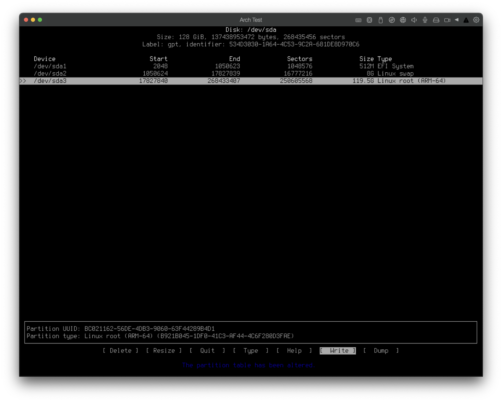

## Can Arch Linux run on MacBook Pro with Parallels?

Yes! I use an Arch Linux ARM VM on my MacBook Pro almost every day. It works quite well.

However, there's a lot of misinformation out there about installing and running Arch Linux on Apple Silicon. At the time of this post, the Arch Linux wiki currently directs users to this article by Parallels to install Arch Linux on Apple Silicon. However, the Parallel instructions are old and do not work.

To be fair, the Arch Wiki does provide a download for a pre-installed VM that is ready to go. However, it's set up with very low storage options (partitioning) and was basically useless for a daily driver for my needs.

I will attempt to keep this post recent.

## Where can I download Arch Linux ARM?

### archboot.com

The best place to download Arch Linux ARM for use with Parallels VM is [archboot.com](https://archboot.com). Download the standard ISO image - at the time of this writing, there is also a "local" (offline) installer, but it doesn't actually work for me. It gets stuck creating a container and never finishes.

### A Note on setup scripts (Do not use them)

Once you download the archboot ISO and boot off it, it will automatically start up with a CLI "GUI" installer helper program. *Do not use this* to install Arch. It is broken. Instead, you should follow the [Installation Guide](https://wiki.archlinux.org/title/Installation_guide) on the Arch Wiki.

You *can* let the GUI set up networking to easily get connected to the internet.

Don't worry, I'll post screenshots of every single step I did to make this work.

## Installation

Alright, let's get started!

### Create and configure new Parallels VM


### Boot live ISO



**Warning:** Do not continue to use the Archboot Basic Setup! If you try to use it to partition disks and install Arch Linux ARM, it will fail and your VM will be in a broken state.

Instead, we're going to exit the Archboot Basic Setup and proceed to (mostly) follow the directions from the official [Arch Linux Installation Guide](https://wiki.archlinux.org/title/Installation_guide).

To get out of the Archboot Basic Setup, just enter `Ctrl + C`, which should dump you directly to the terminal.


### Partition the disks

You can view all your disks and existing partitions with:

```shell
fdisk -l
```

```text
Disk /dev/sda: 128GB, 137438953472 bytes, 268435456 sectors
Disk model: Arch Test-0 SSD
Units: sectors 1 of * 512 bytes / 4096 bytes
I/O size (minimum/optimal): 4096 bytes / 4096 bytes
```

Since we just created this VM and disk, there are no partitions. You should just see `/dev/sda` and any other virtual disks you might have created.

To partition the disks, I prefer using `cfdisk`. Type `cfdisk`, then select `gpt` from the list and press `Enter`:


Now you should see your `/dev/sda` device in `cfdisk`, showing free space:


You can create partitions now. The up/down arrow keys allow you to move up and down the partition list, and right/left allow you to select the commands at the bottom of the screen. Enter executes the selected command.



Make sure your partition types are set correctly. At minimum, you should have:

- `BIOS Boot` - Set this to `2m`
- `EFI System` - Set this to at least 300m. I typically allocate 512m.
- `Linux swap` - I have this set to `8g`. What number you select depends on your use-cases. [Here's a decent article explaining swap sizes](https://opensource.com/article/19/2/swap-space-poll).
- `Linux root (ARM-64)` - Remaining space of the drive.


**Note:** Normally on bare metal I would create a separate partition for `/` and `/home`. For VMs, I typically share a partition for `/` and `/home`. You are free to add as many partitions as you'd like. This is one big reason why I recommend not using the pre-built VM linked to from the Arch Wiki. I'm glad it exists, and you might be fine with it, but I like to have the freedom to set the partition sizes to my needs.

If you have a `/home` partition separate from `/`, make sure to set the partition type for `/` to `Linux root (ARM-64)` and the partition for `/home` to `Linux home`.


Finally, ensure you select `Write` within `cfdisk` and confirm with `yes`, then Enter. Once the partition table is written, you can select `Quit` to exit `cfdisk`.

You can confirm the partitions were created with:

```shell
fdisk -l
```

```text
Device        Start       End   Sectors   Size Type
/dev/sda1      2048      6143      4096     2M BIOS boot
/dev/sda2      6142   1054719   1048576   512M EFI System
/dev/sda3   1054720  17831935  16777216     8G Linux swap
/dev/sda4  17831936 268433407 250601472 119.5G Linux root (ARM-64)
```

### Format the partitions

In case you need to view the partition identifiers, remember to use `fdisk -l`.

#### EFI partition

```shell
mkfs.fat -F 32 /dev/sda2
```

#### Swap space

```shell
mkswap /dev/sda3
```

#### Root and home partitions

```shell
mkfs.ext4 /dev/sda4
```

### Mount partitions

Mount the root volume to `/mnt`.

```shell
mount /dev/sda4 /mnt
```


**Note:** Recall that earlier I mentioned I'm sharing the same partition for `/` and `/home`. If you had a separate partition for `/home` you would want to mount that as well. You would do so with:

```shell
mount --mkdir /dev/sdaX /mnt/home
```



Mount the EFI partition to `/mnt/boot`

```shell
mount --mkdir /dev/sda2 /mnt/boot
```

Activate the swap partition

```shell
swapon /dev/sda3
```

If all went well, you can check that everything is properly mounted with:

```shell
lsblk
```

```text
NAME   MAJ:MIN RM   SIZE RO TYPE MOUNTPOINTS
sda      8:0    0   128G  0 disk 
├─sda1   8:1    0     2M  0 part 
├─sda2   8:2    0   512M  0 part /mnt/boot
├─sda3   8:3    0     8G  0 part [SWAP]
└─sda4   8:4    0 119.5G  0 part /mnt
sr0      11:0   1 342.3M  0 rom
zram0   251:0   0     5G  0 disk /
```


**Note:** You can ignore `sr0` and `zram0` here. We mainly care about `sda`.


### Disable package signing


**Warning:** We're almost ready to load the minimum Arch Linux packages. This is done with `pacstrap`. Both Arch Linux `x86_64` and Arch Linux `aarch64` (ARM) use package signing. While Arch Linux `x86_64` package signing works (and you should use it), I could not get package signing to work in a Parallels VM with `aarch64` (ARM). So we're going to disable it for now.


To disable package signing, edit the file `/etc/pacman.conf` and comment out the line with `SigLevel = Required DatabaseOptional` (comment so you can easily reenable it later) and add a new line with `SigLevel = Never`:

```text
#SigLevel = Required DatabaseOptional
SigLevel = Never
```

### Installing essential packages

`pacstrap` is a tool that comes with Arch Linux to install the initial packages you want for your new setup. At a minimum, you need these packages:

```shell
pacstrap /mnt base linux grub efibootmgr terminus-font
```

I've added `terminus-font` as a minimum for Archboot, otherwise the rest of the process will fail. For vanilla Arch Linux, `terminus-font` is not required.

I prefer to install a few more packages, but of note is `terminus-font` because it doesn't get auto-installed correctly via Archboot, and will cause errors when the linux image is being generated. `dhcpcd` will allow us later to connect to the network with DHCP.

Here's the full `pacstrap` command with all packages I like to install to the mounted root partition `/mnt`.

```shell
pacstrap /mnt base base-devel linux grub efibootmgr bash-completion dhcpcd vim terminus-font git
```

This will take some time to install, depending on your internet connection. Once complete, we can move on to the next step, where we're configure the system.


**Note:** For Archboot ARM, you may see errors when installing the `linux` package via `pacstrap` as it tries to execute `mkinitcpio`. You can ignore these.


### Configure the installation

Generate `/etc/fstab`

```shell
genfstab -U /mnt >> /mnt/etc/fstab
```

Change root into the new system. This will "enter" us into the newly installed environment:

```shell
arch-chroot /mnt
```

Set the time zone

```shell
ln -sf /usr/share/zoneinfo/Region/City /etc/localtime
```

Replace `Region` and `City` with your own. For example, my closest timezone region and city are `America/Detroit`.

Run `hwclock` to generate `/etc/adjtime`:

```shell
hwclock --systohc
```

Configure localization settings:

1. Edit `/etc/locale.gen` and uncomment your locales. Mine is `en_US.UTF-8`.
1. Save and close the file.
1. Run `locale-gen`.

Create `/etc/locale.conf` and set the LANG variable to the value you uncommented in `/etc/locale.gen`:

```shell
LANG=en_US.UTF-8
```

Finally, set your hostname in `/etc/hostname`.

### Disable package signing on the installed OS

I also mentioned earlier that package signing is broken in the current release of Archboot ARM, and we had already disabled it for the live ISO. But after `arch-chroot` we have to disable it again for the installed (not the live ISO) system.

To disable package signing, we do the same thing as before. Edit the file `/etc/pacman.conf` and comment out the line with `SigLevel = Required DatabaseOptional` (comment so you can easily reenable it later) and add a new line with `SigLevel = Never`:


### Initramfs (Installing the Linux kernel)

Earlier I mentioned when running `pacstrap` with the `linux` package might show errors. Just to make sure the Initramfs is configured, we'll manually run:

```shell
mkinitcpio -P
```


**Note:** You may still see warnings when `mkinitcpio -P` runs. You should be able to ignore these at this point.


### Set the root password

Enter this command to set the password for the `root` user:

```shell
passwd
```

Then follow the prompts to enter your password twice.

### Boot loader (Grub)

I prefer Grub as I'm familiar with it, it's super popular, easy to set up, and I know it works with Parallels VMs on ARM, so that's what I'll show here.

That being said, you can try to use whatever boot loader you want. See the Arch Linux Wiki info on [boot loaders](https://wiki.archlinux.org/title/Boot_loader).

Earlier when we ran `pacstrap` we already installed the `grub` and `efibootmgr` packages. If you hadn't, you can install them with:

```shell
pacman -S grub efibootmgr
```

Next, install the bootloader with `grub-install`:

```shell
grub-install --target=arm64-efi --efi-directory=/boot --bootloader-id=GRUB
```

The grub bootloader will use the file `/boot/grub/grub.cfg` to boot the OS each time the VM starts. To generate `grub.cfg`, run:

```shell
grub-mkconfig -o /boot/grub/grub.cfg
```

If successful, you should see output similar to this:

```text
Generating grub configuration file ...
Found linux image: /boot/Image
Warning: os-prober will not be executed to detect other bootable partitions.
Systems on them will not be added to the GRUB boot configuration.
Check GRUB_DISABLE_OS_PROBER documentation entry.
Adding boot menu entry for UEFI Firmware Settings ...
done
```

### Create your user account

```shell
useradd -m -G wheel username
passwd username
```

Enter your password twice.

Now, you probably want to grant your new user the ability to execute commands with `sudo`. To do so, let's edit the `/etc/sudoers` file:

```shell
EDITOR=vim visudo # or nano if you prefer
```

Find this section:

```text
## Uncomment to allow members of group wheel to execute any command
# %wheel ALL=(ALL:ALL) ALL
```

and uncomment this line:

```text
%wheel ALL=(ALL:ALL) ALL
```

Then save the file and close it.

### Reboot

Your system is now installed! Exit the `arch-chroot` environment with `exit` command or `Ctrl + D`. Then you can simply type `reboot` and the VM should reboot.

### Log in to your new VM

Once it reboots, you'll momentarily see this screen:


You can let the timer run to auto-select `Arch Linux` or press enter to start it without waiting for the boot countdown. Once booted, you should see the login screen:


Use the username and password you set when creating your account. You can also log in as `root` user, but that's not recommended.

### Connect the VM to the host network (get on the internet)

You can use all sorts of tools for network configuration. The current default for Arch Linux is [systemd-networkd](https://wiki.archlinux.org/title/Systemd-networkd). You can follow that Arch Wiki article to get set up.

As a quick example, you can enable DHCP. First, get the name of your network interface with `ip link` command, which should return you something like `enp0s5` (in my case). Then you can configure DHCP for the network interface like this:

`/etc/systemd/network/20-wired.network`:

```text
[Match]
Name=enp0s5

[Network]
DHCP=yes
```

Once you've configured `systemd-networkd`, you'll want to next enable it as well as `dhcpcd` so the VM will get connected to the network automatically upon boot:

```shell
sudo systemctl enable systemd-networkd dhcpcd
```

Finally, reboot with `sudo reboot`. After reboot, once you log in, you should be online. You can test with a ping:

```shell
ping archlinux.org
```

### Update Arch Linux

Now we want to update Arch Linux to the latest:

```shell
pacman -Syu
```

### Install Parallels Tools

From the Parallels Actions menu, select `Install Parallels Tools`. Then:

```shell
sudo pacman -S linux-headers dkms
sudo mount --mkdir /dev/cdrom /mnt/cdrom
sudo /mnt/cdrom/install
```

## Final Notes

Hopefully all went well and you've got a functioning minimum Arch Linux installation. If any part of this guide didn't work for you, please reach out as I'd like to know so I can update this article.

If you want a desktop environment, the Arch Linux Wiki [has you covered](https://wiki.archlinux.org/title/Desktop_environment).

I have been using KDE Plasma of late. For a quick setup guide, [see my post here](/posts/kde-plasma-installation).

If you want an easy method for installing unofficial packages from the Arch User Repository (AUR), [see my post here](/posts/arch-linux-yay).
