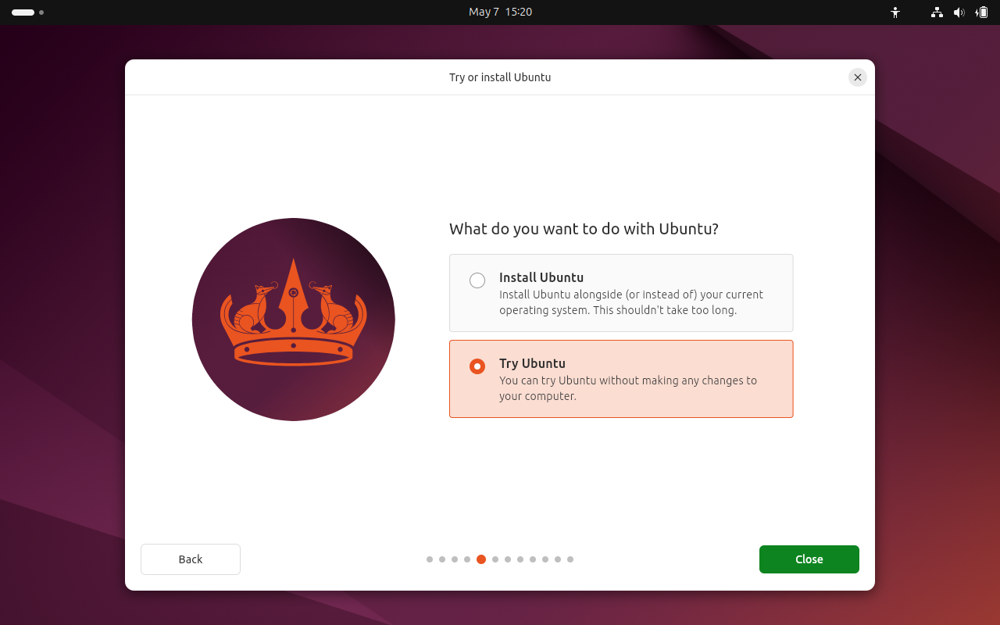
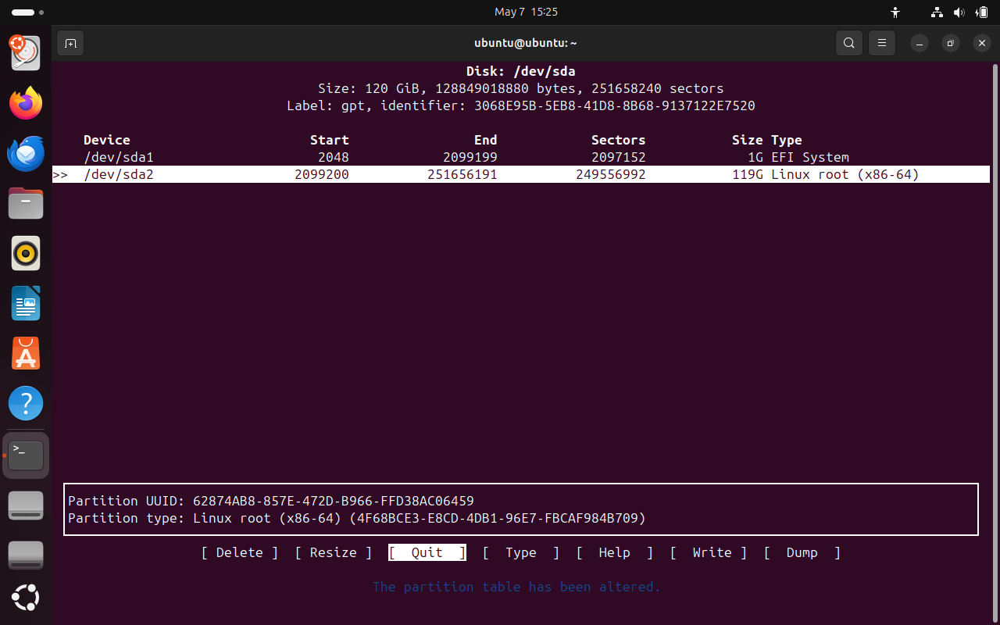
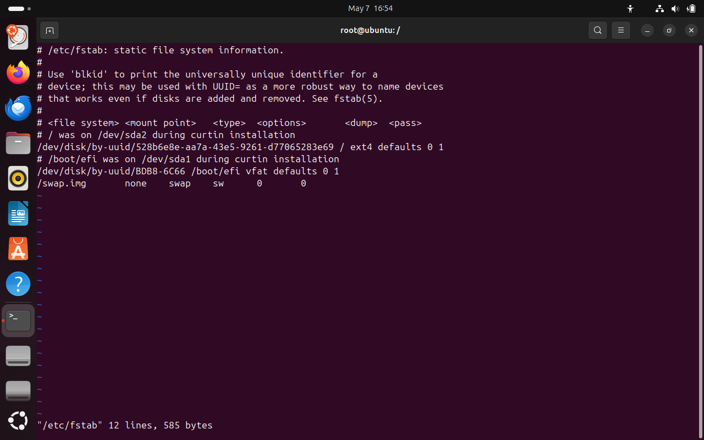
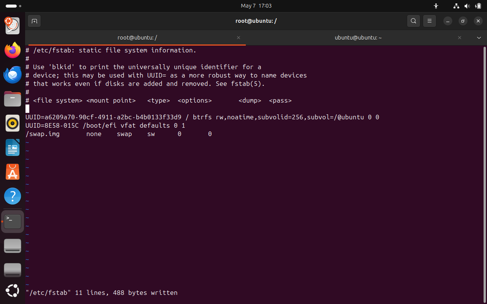

While Ubuntu supports installation to a btrfs partition, it doesn't take full advantage of capabilities of btrfs, specifically making use of subvolumes and snapshots, which is kind of the whole point of btrfs.

If you're going to dual boot (or multiboot) with other distros, from a subvolume, and you install Ubuntu first and follow [this workaround](/posts/btrfs-ubuntu-arch), you're set. But if you have existing Linux distros and want to install Ubuntu to a btrfs subvolume alongside them *after* the other distros were installed, you can't follow that workaround because not only does the Ubuntu installer not support btrfs subvolumes, but the current 24.04 installer forces you to format the existing btrfs root filesystem and you cannot uncheck the option.

There is a workaround that's a bit annoying, but makes it possible. That is to first install Ubuntu in a virtual machine, then back up the Ubuntu root directory and copy it over to a new btrfs filesystem on your physical machine. The process overall looks like this:

1. Install Ubuntu to VM.
2. Back up Ubuntu root from VM, copying to another drive (or network location).
3. Restore the Ubuntu root backup to a fresh btrfs subvolume on the target physical machine.
4. Install grub on the physical machine.
5. Generate initramfs.
6. Update grub config.
7. Ensure UEFI entry is created on the physical machine.

## Ubuntu Installation on VM

I won't cover this part as there are tons of tutorials out there on the internet. The only notworthy mention here is to ensure you don't install any VM guest tools. For example, in VirtualBox there is a guest-utils package for most distros to provide better graphics support, host and guest clipboard access, among others. You don't want to install these additional tools because they won't work properly on your physical machine, so we don't want to copy any kernel modules or other config files specific to the VM hypervisor you're using to initially install Ubuntu.

When installing to the VM, make sure you choose `btrfs` as the root filesystem. Even though we'll later create a new btrfs partition on the target physical machine, choosing btrfs during install will make sure to install the btrfs utilities into the root filesystem, so we can properly generate the initramfs file on the physical drive.

If you forget to choose btrfs at install time, when you later try to generate the initramfs file, it will fail with this error:

```text
W: /sbin/fsck.btrfs doesn't exist, can't install to initramfs
```

If you forgot, you don't have to start all over again and reinstall. There is a workaround I will detail later when we get to that point. But it's just much easier to do the install up front with btrfs.

The TLDR is: Only install vanilla Ubuntu on the VM with btrfs filesystem for root and don't install any further VM-related tooling. Once you've installed Ubuntu, don't reboot. Instead, choose to continue testing Ubuntu and proceed with the rest of these steps.

## Backup your system

Open the terminal in Ubuntu.

The Ubuntu installer mounts your drive (probably `/dev/sda` on a VM) to `/target` to do the install, and it leaves the mount points intact after the installation is complete. This is convenient as we don't have to worry about mounting the new system. After the installation is complete, and you've selected to continue testing Ubuntu, you can verify the mount points are still intact:

```text
$ mount | grep sda
/dev/sda2 on /target type ext4 (rw,relatime)
/dev/sda1 on /target/boot/efi type vfat (rw,relatime,fmask=0022,dmask=0022,codepage=437,iocharset=iso8859-1,shortname=mixed,errors=remount-ro)
```

- `/dev/sda2 on /target type ext4` is the root filesystem.
- `/dev/sda1 on /target/boot/efi type vfat` is the UEFI partition.

`cd` into `/target` and then create a tar ball of the installed root file system:

```text
cd /target
sudo tar -cvpzf ubuntu-24.04-backup.tar.gz --exclude=/target/ubuntu-24.04-backup.tar.gz --one-file-system .
```

Once that's done, copy the `/target/ubuntu-24.04-backup.tar.gz` file to another drive, or over to a network share. Once copied, you can power off the VM - you can even delete it - as we no longer need it.

## Restore Your Backup

Now go to your physical machine and boot it up from the Ubuntu live image. Once the live image presents the dialog to try or install Ubuntu, choose to try (do not install):



## Partition disk

We'll create 2 new partitions on the disk: one for the UEFI partition, then one for the root filesystem.

```text
sudo cfdisk /dev/sda
```

`cfdisk` will ask to create a new partition table. Select `gpt`.

Next, create the two partitions. Here's an example:



Make sure to set the partition type for `/dev/sda1` (the UEFI partition) to `EFI System`. Then set the `/dev/sda2` partition (root filesystem) to `Linux root (x86-64).

Finally, write the partition table, then exit `cfdisk`.

## Format partitions

Next we'll format the EFI partition:

```text
sudo mkfs.fat -F 32 /dev/sda1
```

```text
sudo mkfs.btrfs /dev/sda2
```

## Create btrfs subvolume for Ubuntu

We can now create the btrfs subvolume, where we'll restore our backup. First, mount `/dev/sda2` (where the Ubuntu root will live):

```text
sudo mount /dev/sda2 /mnt
```

Create the btrfs subvolume, which we'll name `@ubuntu`:

```text
sudo btrfs subvolume create /mnt/@ubuntu
```

Now, unmount `/mnt`:

```text
sudo umount /mnt
```

We'll remount `/dev/sda2` again, but this time we're mounting the `@ubuntu` subvolume instead of the root btrfs filesystem:

```text
sudo mount -o subvol=/@ubuntu /dev/sda2 /mnt
```

Now let's mount the EFI partition:

```text
sudo mount --mkdir /dev/sda1 /mnt/boot/efi
```

## Extract ubuntu backup to mounted subvolume

We're now ready to restore our backup. Make sure you have your drive (or network share) containing your Ubuntu backup tar file we created earlier (`ubuntu-24.04-backup.tar.gz`) and untar it to `/mnt`:

```text
sudo tar -xvpzf /path/to/ubuntu-24.04-backup.tar.gz -C /mnt --numeric-owner
```

**Note about network drives**: While not necessary, it's very convenient to have a network drive at home. For example, I run an NFS and Samba server on my home Arch Linux server, on a 24TB hard drive which allows me to easily store retrieve data like this without having to plug in a separate drive.

So in my case I mount my NFS share to save and restore my Ubuntu backup. If you wanted to do the same with NFS, you'd first need to install the NFS client utilities in the Ubuntu live image:

```text
sudo apt update
sudo apt install nfs-common
sudo mount --mkdir 192.168.1.200/mnt/data0 /data0
```

This allows you to then extract the backup directly from the network share to your machine's partition like so:

```text
sudo tar -xvpzf /data0/linux-roots/ubuntu-24.04-backup.tar.gz -C /mnt --numeric-owner
```

Anyway, not required, but for those of you who might be running a home server with a decent storage setup, it's super convenient to not have to deal with external drives, and just rely on your home network storage.

Next mount `/dev`, `/proc`, `/sys` under the Ubuntu root filesystem we just restored:

```text
sudo mount --bind /dev /mnt/dev
sudo mount --bind /sys /mnt/sys
sudo mount --bind /proc /mnt/proc
```

## Update `/etc/fstab`

The backup from the VM will have the UUIDs of the VM drives in the `/etc/fstab` file. We'll need to change those entries to point instead to our physical drives.

`chroot` into the restored Ubuntu environment:

```text
sudo chroot /mnt
```

Edit the `/etc/fstab` file. You can edit with nano or vi if you'd like. You'll see something like this:



We'll need to get the UUIDs of the physical drives. In a new terminal window or tab, run these commands:

```text
sudo blkid /dev/sda1
sudo blkid /dev/sda2
```

On my system, `blkid` shows me:

```text
/dev/sda1: UUID="8E58-015C"
/dev/sda2: UUID="a6209a70-90cf-4911-a2bc-b4b0133f33d9"
```

Copy the UUID for each of those partitions over to `/etc/fstab`, replacing the VM IDs that it currently has.

You'll also need to get the ID for the @ubuntu btrfs subvolume:

```text
sudo btrfs subvolume list /mnt
```

In my case, the ID was 256. That will likely be your ID as well, if this is the first btrfs subvolume you've created on the drive.

Make sure to update the `/etc/fstab` file to reflect the identifiers above. It should look something like this:



Once done, save the file and exit your text editor. Stay in the chroot environment for the next part.

## Install bootloader, initramfs

Install grub:

```text
grub-install
```

Update initramfs:

```text
update-initramfs -u -k all
```

As mentioned earlier, if you forgot to install Ubuntu on the VM with the btrfs filesystem initially, you'll get an error:

```text
W: /sbin/fsck.btrfs doesn't exist, can't install to initramfs
```

To fix this, open a new terminal window - making sure you're in the live environment, not the chroot environment - and run this command:

```text
sudo cp /sbin/fsck.btrfs /mnt/sbin
```

Back in the chroot environment, rerun this command:

```text
update-initramfs -u -k all
```

Next, update grub config:

```text
update-grub
```

Exit the chroot environment:

```text
exit
```

## UEFI entry

`grub-install` should have already created the UEFI entry on your machine. If it didn't, we can manually create one with the tool `efibootmgr`.

View existing UEFI entries

```text
efibootmgr
```

You should see entries like this:

```text
BootCurrent: 0004
Timeout: 0 seconds
BootOrder: 0004,0000,0001,0002,0003
Boot0000* UiApp	FvVol(7cb8bdc9-f8eb-4f34-aaea-3ee4af6516a1)/FvFile(462caa21-7614-4503-836e-8ab6f4662331)
Boot0001* UEFI VBOX CD-ROM VB2-01700376 	PciRoot(0x0)/Pci(0x1,0x1)/Ata(1,0,0){auto_created_boot_option}
Boot0002* UEFI VBOX HARDDISK VBbddbe21d-850647bc 	PciRoot(0x0)/Pci(0xd,0x0)/Sata(0,65535,0){auto_created_boot_option}
Boot0003  EFI Internal Shell	FvVol(7cb8bdc9-f8eb-4f34-aaea-3ee4af6516a1)/FvFile(7c04a583-9e3e-4f1c-ad65-e05268d0b4d1)
Boot0004* Ubuntu	HD(1,GPT,a86974d5-1131-40a6-a5b4-a028228ddb31,0x800,0x200000)/File(\EFI\ubuntu\shimx64.efi)
```

Note this line:

```text
Boot0004* Ubuntu	HD(1,GPT,a86974d5-1131-40a6-a5b4-a028228ddb31,0x800,0x200000)/File(\EFI\ubuntu\shimx64.efi)
```

That's the line you want to see. If an Ubuntu entry is present, you can move on. If it's missing, let's create it:

```text
sudo efibootmgr -c -d /dev/sda2 -L Ubuntu -l '/EFI/ubuntu/shimx64.efi'
```

If you messed up the entry, you can delete it:

```text
sudo efibootmgr -B -b 0004
```

The `-b 0004` argument number should match the number for the Ubuntu EFI entry you want to delete. If it's `Boot0004` then pass it as `0004`.

After making a change, you can always confirm the UEFI entry by running `efibootmgr` with no commands (you also don't need `sudo` if you're just listing entries or viewing help). If you want to print the help menu, run `efibootmgr --help`.

## Unmount the installation drive and reboot

You can now unmount everything under the Ubuntu installation directory (`/mnt`) and reboot:

```text
sudo umount -R /mnt
reboot
```

Your system should reboot and load into Ubuntu.

## If you didn't install the VM as btrfs

If you didn't use btrfs for the VM installation, even if you use the workaround I showed above, after rebooting and confirming you're able to log in and the system is working, you'll be missing the utilities for btrfs to manage your subvolumes and snapshots. So after rebooting into your newly restored system, you'll want to do the following:

```text
sudo apt update
sudo apt install btrfs-progs
```

`btrfs-progs` will allow you to manage your subvolumes and snapshots. For example, to list subvolumes:

```text
sudo btrfs subvolume list /
```

Which will show our newly installed `@ubuntu` subvolume:

```text
ID 256 gen 96 top level 5 path @ubuntu
```

## Final notes

This process works for other Linux distros as well. I have multiple distros installed under separate btrfs subvolumes, which allows me to boot into anything I want, without having to create separate partitions - which saves a lot of disk space and allows me the flexibility to snapshot any of the distros (and boot into those snapshots as desired).

I really wish the Ubuntu installer allowed us to install to a btrfs subvolume. The entire point of having btrfs is to use subvolumes and snapshots. Offering the option to use btrfs as the root filesystem, as Ubuntu does, seems rather pointless. Perhaps some day they will add this capability into the installer but until then, this method works.
