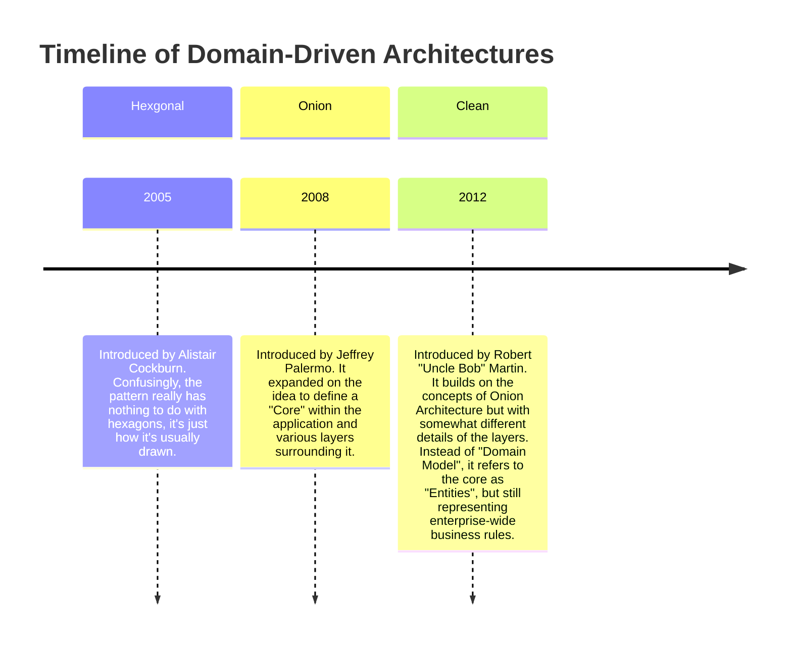
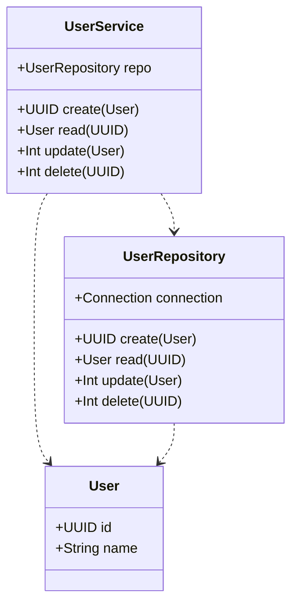
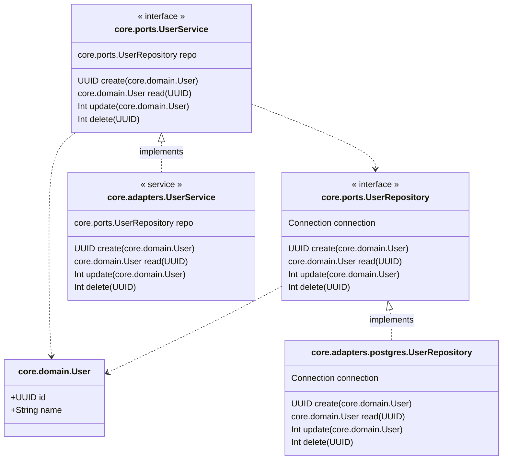

Domain driven architectures are design patterns that focus on separating *what* a program does from *how* it does it. There are a few variations out there, but the overall goal is to structure the program in a clear and concise manner so that it is immediately clear what the program is doing, without having to spend a lot of time reading through code to understand how it operates on a low level.

Let's say we're writing some software that's going to talk to a database. We need to store records, retrieve them, update them and sometimes delete them. These operations are commonly called CRUD (Create, Read, Update, Delete). Software often ends up with the details of *how* to do CRUD operations mixed in with the flow of our program. Then, when we or others try reading our code, it's often difficult to see the full logic of our program at a glance.

While CRUD operations are typical in much of today's enterprise software, there are *algorithmic* programs which also benefit from domain-driven architectures.



## Hexagonal Architecture

You may have heard of hexagonal architecture, but wondered what it is. It's a design pattern that focuses on separating logic from implementation. But what does that mean?

With hexagonal architecture, we define *what* our program is doing and then write separate implementations for *how* our program does accomplishes tasks. The *what* is defined in *ports* and the *how* is defined in *adapters*.

### An Example Without Hexagonal Architecture

Let's start with an example. If we have a user service that can CRUD users, we might build a `UserRepository` and a `UserService` like this:



If we are going to create a user, we would call the `UserService.create(User)`. Writing this in Scala might look like this:



This looks great. It works, the service is calling a repository to do the saving, and we get the ID back from the database call, ensuring the user was saved.

But what if we first wrote this with PostgreSQL and later decided we wanted to support both PostgreSQL and DynamoDB? The current design doesn't allow us to do that. This is where hexagonal architecture comes in. Rather than defining a `UserService` and `UserRepository`, we can define these using ports and adapters.

### Using Hexagonal Architecture: Ports and Adapters

With hexagonal architecture, we would define ports, then implement the behavior in adapters. If we apply this principal to our user service, we would start in Scala with these traits:

- `core.ports.UserRepository`
- `core.ports.UserService`

And then we would define adapters to describe our implementations. One way to do this is by creating Scala classes that extend the "port" traits above:

- `core.adapters.UserRepository`
- `core.adapters.UserService`

This makes our original design now look something like this:



Instead of classes to implement our trait functionality, we can also define initialization functions for our traits:

```scala
def userPostgresRepository = new UserRepository {...}

def userService(repo: UserRepository) = new UserService {...}
```

Putting all this together, we can write a program like this:



## Onion Architecture

## Clean Architecture
