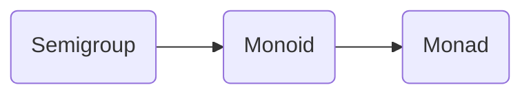
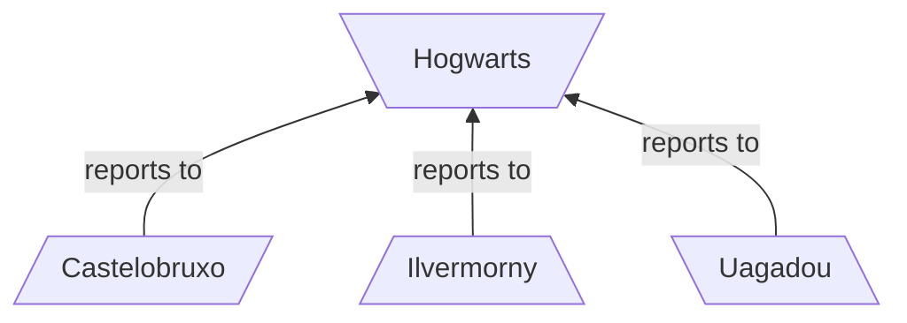
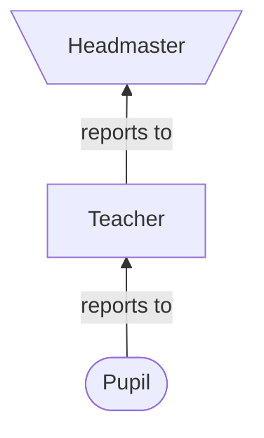

Here's a practical concept that can be solved nicely by functional programming, and it'll hopefully help demonstrate the hierarchy between `Semigroups`, `Monoids` and `Monads`. I won't cover the latter two in this post (but will in a future post), however for reference the hierarchy is as follows:



## Wizard Schools

Let's say there is a school for wizards and the school is actually a group of schools in different geographical locations, but they all report to one central school, Hogwarts. The hierarchy would be something like this:



Now each school has a headmaster, teachers who report to the headmaster, and pupils who report to their teachers:



## A War

A war has broken out, and all the schools must coordinate with one another to defend the realm. Some of the schools need help from the other schools. During the battles, the Grand Wizards want to know which headmasters, teachers and pupils are working together to fight in each battle.

## Coding time

Let's start by modeling our wizards:

```scala
trait Wizard {
    val name: String
}

case class GrandWizard extends Wizard
```
