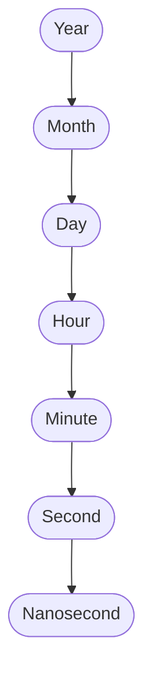
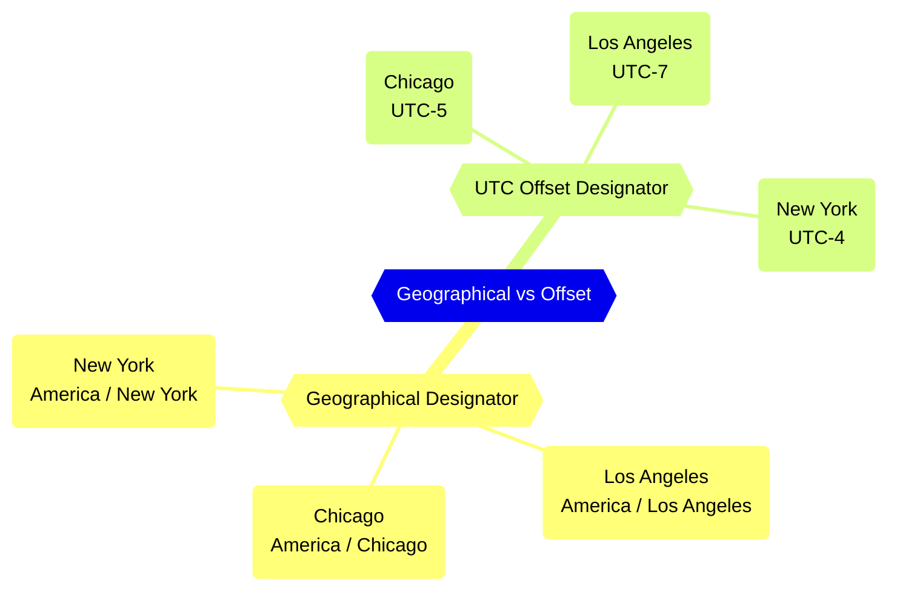

## Time is fraught with complexity

Most people think of time in a highly contextually-dependent way. You think of time as "5:00 PM today" or "Tuesday, I have a meeting at 9:00 AM." However, when computers deal with time, we have to be very careful what we mean in a very precise way.

Here is a really good video from [Computerphile](https://www.youtube.com/@Computerphile) about the difficulties with representing time, especially when it comes to computers:



When we think about how to represent time, we require several pieces of information:

- Time is relative, so where are we located? Time zones and offsets can answer this question.
- What means of measuring time are we using? Typically we'd use the Gregorian calendar.
- What granularity of time do we want to measure? For the Gregorian calendar, this would break down as:



## Representing Time Zones

### UTC (Coordinated Universal Time)

[From Wikipedia](https://en.wikipedia.org/wiki/Coordinated_Universal_Time):

> Coordinated Universal Time or UTC is the primary time standard by which the world regulates clocks and time. It is within about one second of mean solar time (such as UT1) at 0° longitude (at the IERS Reference Meridian as the currently used prime meridian) and is not adjusted for daylight saving time. It is effectively a successor to Greenwich Mean Time (GMT).

You can see `Coordinated Universal Time` (or UTC) on the Wikipedia map here:


### GMT (Greenwich Mean Time)

[From Wikipedia](https://en.wikipedia.org/wiki/Greenwich_Mean_Time):

> Greenwich Mean Time (GMT) is the mean solar time at the Royal Observatory in Greenwich, London, counted from midnight. At different times in the past, it has been calculated in different ways, including being calculated from noon; as a consequence, it cannot be used to specify a particular time unless a context is given. The term 'GMT' is also used as one of the names for the time zone UTC+00:00 and, in UK law, is the basis for civil time in the United Kingdom.
>
> English speakers often use GMT as a synonym for Coordinated Universal Time (UTC). For navigation, it is considered equivalent to UT1 (the modern form of mean solar time at 0° longitude); but this meaning can differ from UTC by up to 0.9 s. The term GMT should thus not be used for purposes that require precision.

So basically, GMT is basically ignored, though most English speakers might still use it as a synonym for UTC. Consequently in most cases when folks say "GMT" what they really mean is "UTC".

### Local Time

[From Wikipedia](https://en.wikipedia.org/wiki/Local_time):

> Local time is the time observed in a specific locality. There is no canonical definition. Originally it was mean solar time, but since the introduction of time zones it is generally the time as determined by the time zone in effect, with daylight saving time where and when applicable. In some places this is known as standard time.
>
> Some sources continue to use the term local time to mean solar time as opposed to standard time, but they are in the minority. Terms such as local mean time also relate to solar time.

### Zone Designators

As mentioned earlier, precise timekeeping requires either:

- Tracking the geographic location from which the time is represented
- Tracking the offset from UTC time `+/-`



An older geographical designator was used historically, and it represented locations in broader regional terms. For example:

- `Pacific` for `Los Angeles`
- `Central` for `Chicago`
- `Eastern` for `New York`

However, the newer time standard makes use of geo-political entities rather than broad regions. So for the cities shown so far, this would become:

- `America/Los Angeles`
- `America/Chicago`
- `America/New York`

When going with the geographical location method, one should use the newer geo-political format when possible. This is because geo-political entities in theory *could* change their UTC-relative offset independent of a larger geo-political body.

For example, the State of Illinois could define the offset as `UTC-4` but the City of Chicago could define its offset as `UTC-5` because Chicago decided it wants to keep in sync with New York. While this is not something likely to happen frequently (if ever), the geo-political standard is more precise and allows for encoding offsets for each geo-political body so the offset can be computed and inferred across all components of a system or between disparate systems.

## Epoch Time

[From Wikipedia](https://en.wikipedia.org/wiki/Epoch_(computing)):

> In computing, an epoch is a date and time from which a computer measures system time. Most computer systems determine time as a number representing the seconds removed from particular arbitrary date and time. For instance, Unix and POSIX measure time as the number of seconds that have passed since Thursday 1 January 1970 00:00:00 UT, a point in time known as the Unix epoch. Windows NT systems, up to and including Windows 11 and Windows Server 2022, measure time as the number of 100-nanosecond intervals that have passed since 1 January 1601 00:00:00 UTC, making that point in time the epoch for those systems.[1]
>
> Computing epochs are nearly always specified as midnight Universal Time on some particular date.

## Representing Time in Computing

### `date` command

Lots of Unix operating systems include a CLI utility called `date`. On macOS you can generate timestamps using this command.

#### Epoch Time

```
date '+%s'
1684522981
```

#### ISO-8601 Standard

```
date -u +%FT%TZ
2023-05-19T19:03:14Z
```

#### `date` command emits a newline

The `date` command appends a newline to the output, which can be frustrating when copying and pasting from the terminal. We can see this if we do a `hexdump` of the `date` command.

Notice the output `|:26Z.|` - this shows the newline as a `.` on the end:

```
date -u +%FT%TZ | hexdump -C
00000000  32 30 32 33 2d 30 35 2d  31 39 54 31 39 3a 30 33  |2023-05-19T19:03|
00000010  3a 32 36 5a 0a                                    |:26Z.|
00000015
```

Now we apply `tr -d \\n` to remove the newline:

```
date -u +%FT%TZ | tr -d \\n | hexdump -C
00000000  32 30 32 33 2d 30 35 2d  31 39 54 31 39 3a 30 33  |2023-05-19T19:03|
00000010  3a 33 38 5a                                       |:38Z|
00000014
```

We can verify the removal of newline carries through to the clipboard by piping in `pbcopy && pbpaste` (on macOS):

```
date -u +%FT%TZ | tr -d \\n | pbcopy && pbpaste | hexdump -C
00000000  32 30 32 33 2d 30 35 2d  31 39 54 31 39 3a 30 33  |2023-05-19T19:03|
00000010  3a 35 30 5a                                       |:50Z|
00000014
```

Finally, we can see that to concisely generate an ISO-8601 timestamp of the current time, while also removing the newline and copying to your clipboard, you would use:

```
date -u +%FT%TZ | tr -d \\n | pbcopy
```

1. `date -u +%FT%TZ` generates the date in UTC ISO-8601 with timezone.
2. `tr -d \\n` removes the trailing newline.
3. `pbcopy` copies to the clipboard (on macOS)

### The JVM (Scala/Kotlin/Java)

#### UTC Time

##### `OffsetDateTime`

##### `ZonedDateTime`

#### Local Time

#### `LocalDateTime`
