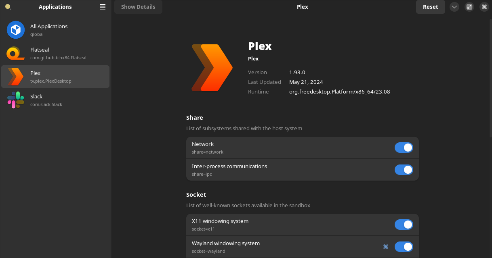

If you're using Hyprland (which uses Wayland), you're trying to use Plex Desktop from flatpak, and it won't load, changes are it's because Plex needs Wayland permissions.

Try running Plex from command line to confirm. You can do this with:

```text
flatpak run tv.plex.PlexDesktop
```

If you see this error:

```text
/app/bin/Plex: line 48:     5 Aborted                 (core dumped) "$BASE_DIR"/bin/plex-bin "$@"
```

...then it almost certainly is a permissions issue.

The easiest way to fix this is with Flatseal.

## Fixing permissions with Flatseal

First, install flatseal

```text
flatpak install flatseal
```

Then launch Flatseal and toggle on `Wayland windowing system` to grant Plex permissions to Wayland:



You can now close Flatseal. You should be able to launch Plex Desktop now!
